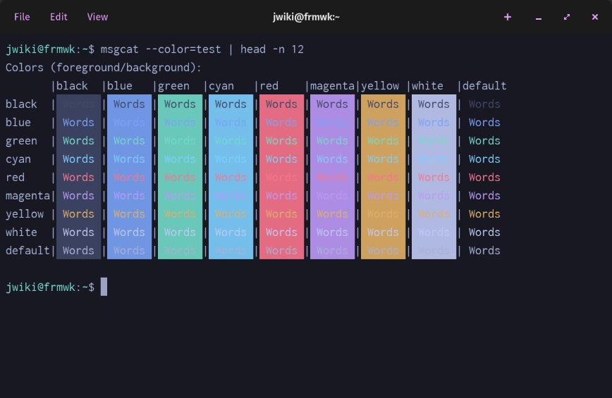
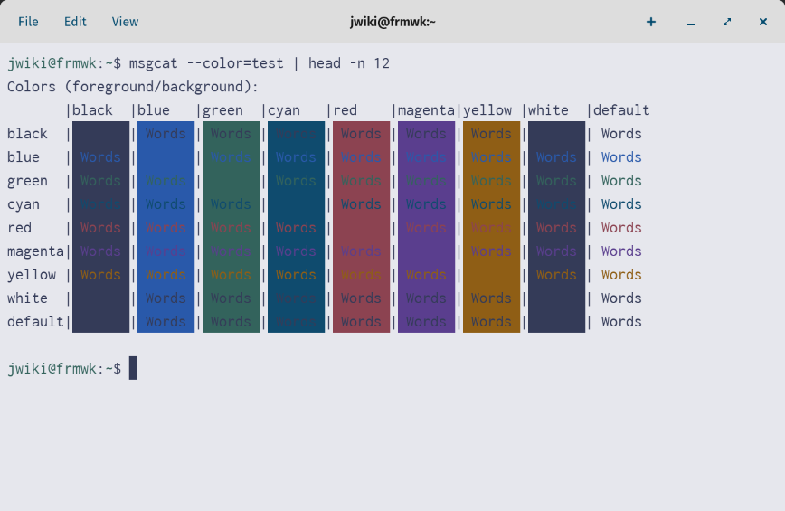

# tokyo-night-cosmic-term

A port of the Tokyo Night and Tokyo Night Light [themes](https://www.github.com/tokyo-night/tokyo-night-vscode-theme) compatible with [COSMIC Terminal](https://github.com/pop-os/cosmic-term).

## Installation

Add the desired color palette to cosmic-term using the menu `View -> Color schemes...` and apply color schemes using `View -> Settings...`

## Screenshots

### Night

### Light

## Special Thanks

[@enkia](https://www.github.com/enkia) for creating the original vscode color theme

[@pop-os] for creating COSMIC Desktop and COSMIC Terminal

## Contributions

The early versions are only including minmimum functionality, so any fixes or enhancements are welcome by pull request.

